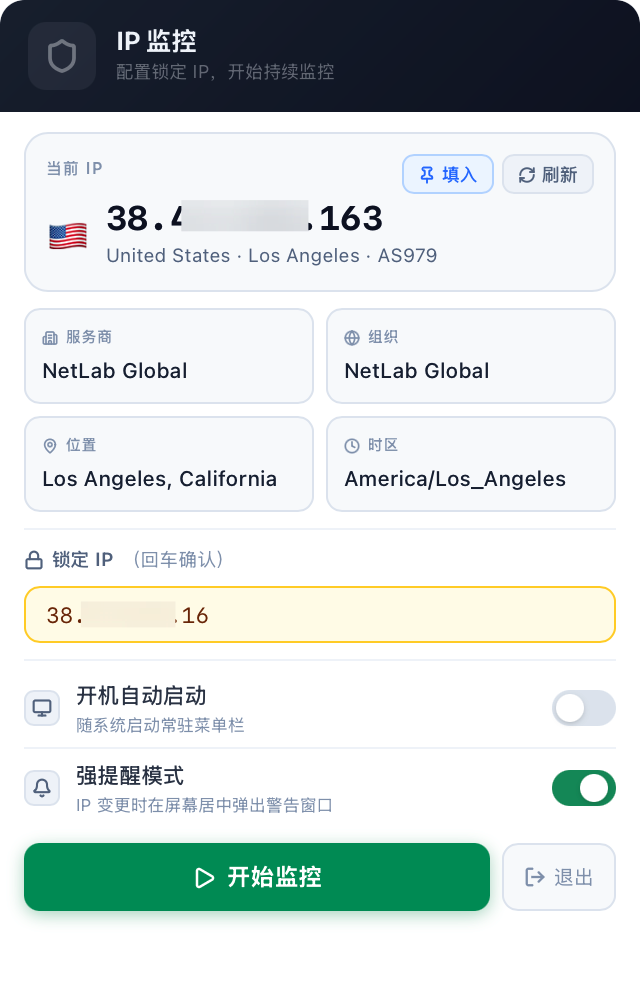
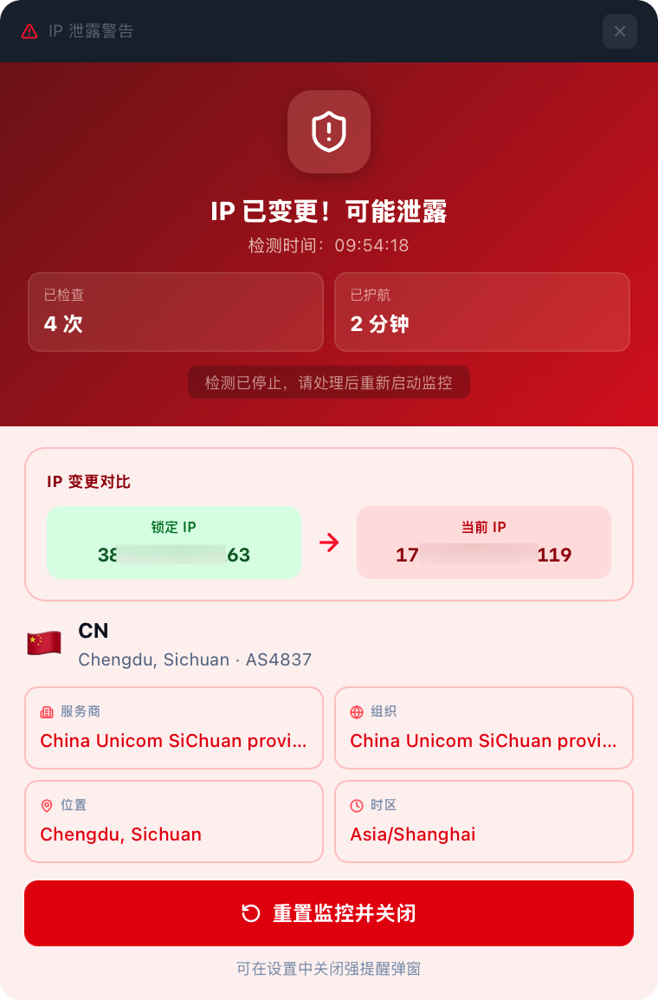

# IP Monitor

IP Monitor is a standalone macOS menu bar app that continuously checks whether your current outbound IP still matches the proxy IP you locked. It is designed as a local reminder tool for proxy, VPN, remote-work network, or real-IP leak prevention workflows.

## Features

- Menu bar monitoring: shows idle, safe, and alert states through the tray icon.
- Locked outbound IP: fill the locked value from the current IP with one click, then start monitoring.
- Periodic checks: checks the current public IP every 60 seconds by default.
- Strong alert window: shows an always-on-top alert when the IP changes, then stops further polling.
- Alert comparison: displays the locked IP, current IP, country or region, city, ASN, and provider information.
- Monitoring stats: shows the check count and protected duration at the top of the alert window.
- Launch at login: can be enabled in settings to start automatically after macOS login.
- Multilingual UI: supports English and Chinese, with English as the default.

## Screenshots

The app has two main interfaces.

### Menu Bar Panel

Configure the locked IP, view the current IP, and control monitoring.



### Alert Window

Shows an always-on-top warning when the outbound IP changes, including the IP difference and monitoring stats.



## Development

```bash
npm install
npm run tauri dev
```

Common checks:

```bash
npm test -- --run
npx tsc --noEmit
npm run build
cargo check --manifest-path src-tauri/Cargo.toml
```

## Installation

### Local Bypass for an Unsigned DMG

If macOS shows `"IP Monitor" is damaged and can't be opened`, remove the quarantine attribute from the DMG:

```bash
xattr -dr com.apple.quarantine ~/Downloads/IP\ Monitor_0.2.0_aarch64.dmg
```

Then reopen the DMG and drag the app into Applications.

If the app has already been moved into Applications and still fails to open, run:

```bash
xattr -dr com.apple.quarantine /Applications/IP\ Monitor.app
open /Applications/IP\ Monitor.app
```

This only bypasses the Gatekeeper quarantine check on the current machine. Because the app is not signed with an Apple Developer certificate, this local bypass is currently required.

## Tech Stack

- Tauri v2
- React 18
- TypeScript
- Vite
- Tailwind CSS utility classes

## License

MIT License. See [LICENSE](LICENSE).
